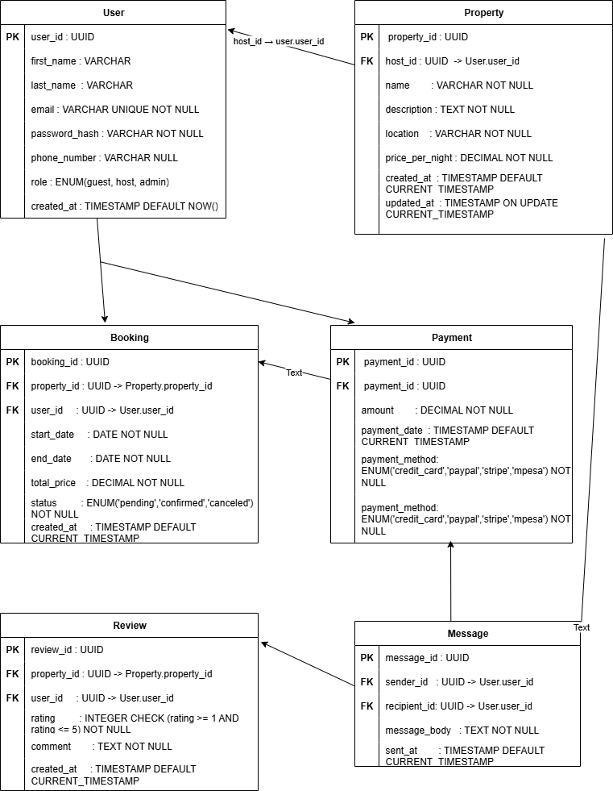

# ER Diagram for Airbnb Database

This ER diagram shows the main entities and relationships for the Airbnb-like app.

**Entities**: User, Property, Booking, Payment, Review, Message

**Key relationships**:
- User (1) → (0..*) Property [host_id]
- User (1) → (0..*) Booking [user_id]
- Property (1) → (0..*) Booking [property_id]
- Booking (1) → (0..*) Payment [booking_id]
- User (1) → (0..*) Review [user_id]
- Property (1) → (0..*) Review [property_id]
- User (1) → (0..*) Message (sender) [sender_id]
- User (1) → (0..*) Message (recipient) [recipient_id]
